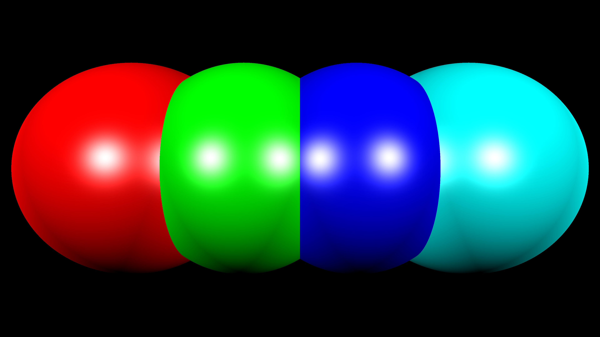

# Basic Ray Tracing in C++

To run the program use:

```
make run
```

On running the program, it asks for the path to a scene file (sample file scene.json is given) and a path to the destination file where the final image will be stored in ppm format.

## Latest update:

- Reflection and Refraction added
- Scene file format changed from custom definition to JSON

## Syntax for the scene file:

```json
{
	"camera": [x, y, z],
	"resolution": [w, h],
	"objects": [{...}, {...}],
	"lights": [{...}, {...}]
}
```

Currently, the only supported object type is a sphere and the only supported light type is point light.

### Fields for object

<table>
	<tr>
		<th>Field</th><th>Format</th><th>Default</th>
	</tr>
	<tr>
		<td>id</td><td>string</td><td>No default; currently unused</td>
	</tr>
	<tr>
		<td>type</td><td>string</td><td>"sphere"; field currently ignored</td>
	</tr>
	<tr>
		<td>radius</td><td>double</td><td>0</td>
	</tr>
	<tr>
		<td>center</td><td>[double, double, double]</td><td>[0, 0, 0]</td>
	</tr>
	<tr>
		<td>material</td><td>JSON object</td><td>Check [Fields for material](#fields-for-material) section</td>
	</tr>
</table>

### Fields for material

<table>
	<tr>
		<th>Field</th><th>Format</th><th>Default</th>
	</tr>
	<tr>
		<td>color</td><td>string or [double, double, double]</td><td>"#000000" or [0, 0, 0]; uses RGB format</td>
	</tr>
	<tr>
		<td>ambient</td><td>double</td><td>0.05</td>
	</tr>
	<tr>
		<td>diffuse</td><td>double</td><td>1.0</td>
	</tr>
	<tr>
		<td>specular</td><td>double</td><td>1.0</td>
	</tr>
	<tr>
		<td>reflection</td><td>double</td><td>0.5</td>
	</tr>
	<tr>
		<td>refraction</td><td>double</td><td>0.5</td>
	</tr>
	<tr>
		<td>refr_ind</td><td>double</td><td>1.0</td>
	</tr>
</table>

### Fields for light

<table>
	<tr>
		<th>Field</th><th>Format</th><th>Default</th>
	</tr>
	<tr>
		<td>id</td><td>string</td><td>No default; currently unused</td>
	</tr>
	<tr>
		<td>type</td><td>string</td><td>No default; only "point" currently supported</td>
	</tr>
	<tr>
		<td>position</td><td>[double, double, double]</td><td>[0, 0, 0]</td>
	</tr>
	<tr>
		<td>color</td><td>string or [double, double, double]</td><td>"#000000" or [0, 0, 0]; uses RGB format</td>
	</tr>
</table>

## Sample output image

In the following sample output, the 4 spheres are not intersecting with each other. They reflect and refract off of each other to give the result seen below. While the actual output of the code is a .ppm file, the image has been converted to JPEG format using GIMP to be embedded in this ReadMe file.



## Bug:
1. *FIXED* - The rendering processes randomly stops around 3/4 of the way without throwing exceptions when the aspect ratio of the final image is not 1.0 (Return code: -1073740940)

**Log of the output where bug occurred is given under the bug_logs directory.**

**The fix for bugs given in [Fixes.md](./Fixes.md).**